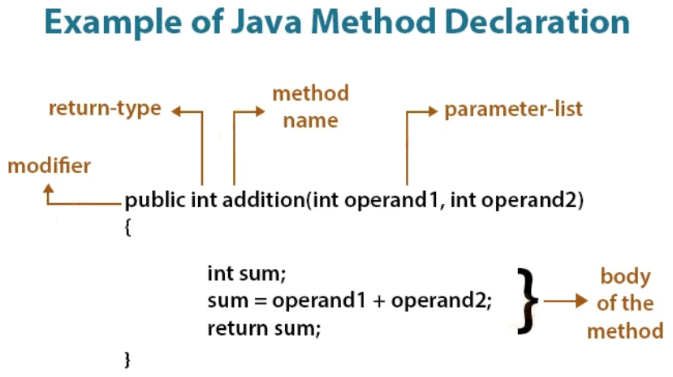

<h1 align="center">
    🍵Basic JAVA training
</h1>

<h2>This training is a live training with oral explanations and demonstrations, so the textual version may lake some informations</h2>

# Session 1

## Startup a project in Intellij

- 
- Install the <a href="https://www.jetbrains.com/toolbox-app/">Jetbrains toolbox</a>
- Install Intellij from the toolbox
- Launch Intellij
- Clone this repository and open the `pom.xml`
- Configure an SDK from the menu `File -> project structure` (Choose a JDK 17 or more)
- Open the `src/main/java/com/github/philippepeter/javatraining/Application.java` file
- Click on the green rectangle

 

Congratulation you have compile and run your first Java program 🎉

You can continue to read this README.md from Intellij

Each session have the Java code examples in the `com.github.philippepeter.javatraining` package 

You can run the Session1 example like you run the Application before

In Java, the starting point of a program must be main method written like that:

```java
    public static void main(String[] args) {
        // Application code here
    }
```

`//` is a commented line that will not be executed.

## Object language basics

All code in Java must be written inside a class.

class = Object, the definition of the Object. It can contain internal state (values) and do things (methods)

By convention each class is written in a .java file for name the name of the class. 

We can sometimes have multiple classes in the same Java file. 

The package keyword on the first line of a class is used to order classes in folders. For example:

``` java
package a.b
public class MyFirstClass {
}
```

The MyFirstClass.java file must be in a subfolder a/b of the sources folder

The `public` keyword means that it can be used/called from another class

The code leaves inside blocks { }

An instance means a created Object, we can create several instances of the same object using the keyword `new`

``` java
MyFirstClass instance1 = new MyFirstClass();
MyFirstClass instance2 = new MyFirstClass();
```

To add behavior to a class we add methods:


`void` is a keyword for a method that returns nothing

```java
public class MyFirstClass {
    void sayHello(String name) {
        System.out.println("Hello " + name);
    }
}
```

> **Note**
> `System.out.println()` is a method to write text in the terminal

To call a method use a dot on an instance of a class: instance.methode()

```java
instance1.sayHello("World");
```

To add a state to a class we add variables. By convention, private variables are preferred, and the users/callers of the instance only use public methods to do things or retrieve state. It means that the internal state of a class is not directly accessible.

Java provides data types, in this example we use `int`, it is an integer numerical value that we initialise or change with `=`

```java
public class MyFirstClass {

    private int variable = 2;
    
    void sayHello(String name) {
        System.out.println("Hello " + name + " my internal state is " + variable);
    }

}
```

Let's change the internal state with a method, the keyword this is used to be sure we use the internal class variable:

```java
 void setVariable(int variable) {
        this.variable = variable;
    }
```

Now we can see the difference of having created two instances of MyFirstClass

```java
MyFirstClass instance1 = new MyFirstClass();
        MyFirstClass instance2 = new MyFirstClass();

        instance1.setVariable(5);
        instance2.setVariable(6);

        instance1.sayHello("Nekobasu");
        instance2.sayHello("Totoro");

```

## Summarize
When learn the following Java keywords
- `class`
-  `new`
-  `public` and `private`
-  `void`
-  `int`
-  `=`
-  `{}`


## Exercises
Create a Counter class with
- A sayHello() method that displays in the console "Hello my internal value is 0" and returns nothing
- An increment() method that increment by one the internal value and returns nothing

Create a little application in a main method that does:
- Creates two instances of counter
- Call increment method on one of them
- Call sayHello() on both of them
- See that one as an internal value of 0 and the over of 1
